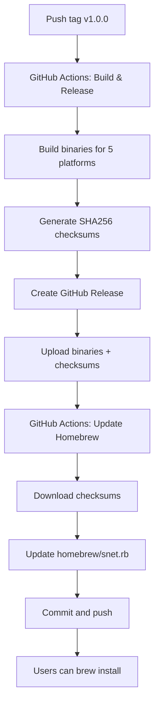

# Setup Summary: Homebrew Distribution & CI/CD

Complete overview of the Homebrew distribution and GitHub Actions setup for snet-cli.

## 📦 What Was Created

### 1. Homebrew Formula

**File:** `homebrew/snet.rb`

A multi-platform Homebrew formula supporting:
- ✅ macOS Intel (x86_64)
- ✅ macOS Apple Silicon (ARM64)
- ✅ Linux x86_64
- ✅ Linux ARM64

Users can install with:
```bash
# Direct from this repo (works immediately)
brew install sethhorsley/snet-cli/snet

# From custom tap (after setting up homebrew-tap repo)
brew install seth4242/tap/snet
```

### 2. GitHub Actions Workflows

#### `build.yml` - Build & Release Pipeline

**Triggers:**
- Push to `main` branch → Beta builds (development mode)
- Push version tag (`v*`) → Production builds + GitHub Release
- Pull requests → Test builds

**Features:**
- Builds for 5 platforms (macOS, Linux, Windows)
- Generates SHA256 checksums for verification
- Creates GitHub Releases automatically
- Uploads artifacts (30-90 day retention)

#### `update-homebrew.yml` - Automatic Formula Updates

**Triggers:**
- New GitHub Release published
- Manual trigger with version input

**Features:**
- Downloads SHA256 checksums from release
- Updates `homebrew/snet.rb` with new version and checksums
- Commits and pushes changes automatically
- Optional: Updates separate tap repository

### 3. Helper Scripts

**File:** `scripts/update-homebrew-formula.sh`

Manual script for updating the formula:
```bash
./scripts/update-homebrew-formula.sh v1.0.0
```

### 4. Documentation

- `homebrew/README.md` - Homebrew setup and maintenance guide
- `.github/workflows/README.md` - GitHub Actions documentation
- `.github/RELEASE_CHECKLIST.md` - Step-by-step release process
- `HOMEBREW_SETUP.md` - Complete setup guide
- `SETUP_SUMMARY.md` - This file

## 🚀 Installation Methods Now Available

### Method 1: Homebrew (Direct from repo)
```bash
brew install sethhorsley/snet-cli/snet
```
✅ **Works immediately, no setup needed**

### Method 2: Homebrew (Custom tap)
```bash
brew install seth4242/tap/snet
```
⏳ **Requires creating `homebrew-tap` repository** (see HOMEBREW_SETUP.md)

### Method 3: Direct Download
```bash
# macOS Apple Silicon
curl -L https://github.com/sethhorsley/snet-cli/releases/latest/download/snet-darwin-arm64.tar.gz | tar xz
sudo mv snet-darwin-arm64 /usr/local/bin/snet
```

### Method 4: From Source
```bash
go install github.com/seth4242/snet@latest
```

## 📋 Quick Start: Your First Release

### Prerequisites
- Code ready on `main` branch
- Committed and pushed all changes

### Steps

1. **Create and push tag:**
   ```bash
   git tag -a v1.0.0 -m "Release v1.0.0: Initial release"
   git push origin v1.0.0
   ```

2. **Wait for GitHub Actions** (5-10 minutes)
   - Watch at: https://github.com/sethhorsley/snet-cli/actions

3. **Verify release:**
   - Visit: https://github.com/sethhorsley/snet-cli/releases
   - Check all binaries and checksums are present

4. **Test installation:**
   ```bash
   brew install sethhorsley/snet-cli/snet
   snet version  # Should show v1.0.0
   ```

5. **Done!** 🎉

See `.github/RELEASE_CHECKLIST.md` for detailed checklist.

## 🔄 What Happens on Release

When you push a version tag (`v1.0.0`):



**Fully automatic!** Just push a tag and everything happens.

## 📁 File Structure

```
snet-cli/
├── .github/
│   ├── workflows/
│   │   ├── build.yml              # Main CI/CD pipeline
│   │   ├── update-homebrew.yml    # Auto-update formula
│   │   └── README.md              # Workflow docs
│   └── RELEASE_CHECKLIST.md       # Release process guide
├── homebrew/
│   ├── snet.rb                    # Homebrew formula
│   └── README.md                  # Homebrew guide
├── scripts/
│   ├── update-homebrew-formula.sh # Manual formula updater
│   └── download-frpc.sh           # (existing)
├── HOMEBREW_SETUP.md              # Complete setup guide
├── SETUP_SUMMARY.md               # This file
└── README.md                      # Updated with install methods
```

## ✅ What's Ready to Use Now

- ✅ GitHub Actions build pipeline
- ✅ Automatic releases on git tags
- ✅ SHA256 checksums for security
- ✅ Homebrew formula (template)
- ✅ Auto-update workflow
- ✅ Direct installation: `brew install sethhorsley/snet-cli/snet`
- ✅ Download from GitHub Releases
- ✅ Complete documentation

## ⏳ Optional Setup Steps

### Create Separate Homebrew Tap (Optional but Recommended)

For cleaner installation experience: `brew install seth4242/tap/snet`

**Steps:**
1. Create GitHub repo: `homebrew-tap`
2. Add `Formula/snet.rb` 
3. Configure auto-updates (optional)

See `HOMEBREW_SETUP.md` for detailed instructions.

### Submit to Homebrew Core (Future)

Once the project is mature:
- Requires 75+ GitHub stars
- Stable release history
- Active maintenance
- Submit PR to https://github.com/Homebrew/homebrew-core

Then users can: `brew install snet`

## 🧪 Testing

### Test Local Build
```bash
make build-prod
./bin/snet version
```

### Test Homebrew Formula
```bash
brew install --build-from-source homebrew/snet.rb
snet version
brew uninstall snet
```

### Test From GitHub (after first release)
```bash
brew install sethhorsley/snet-cli/snet
snet version
```

## 📊 Build Matrix

| Platform | Arch | Beta | Prod | Format |
|----------|------|------|------|--------|
| macOS | Intel | ✅ | ✅ | .tar.gz |
| macOS | ARM64 | ✅ | ✅ | .tar.gz |
| Linux | x86_64 | ✅ | ✅ | .tar.gz |
| Linux | ARM64 | ✅ | ✅ | .tar.gz |
| Windows | x86_64 | ❌ | ✅ | .zip |

**Beta builds:** Development mode (localhost:3001)  
**Production builds:** Production mode (seth4242.net)

## 🎯 Next Steps

### Before First Release

1. **Review workflows:**
   ```bash
   cat .github/workflows/build.yml
   cat .github/workflows/update-homebrew.yml
   ```

2. **Update Go version if needed:**
   - Go 1.25.0 might not exist yet in GitHub Actions
   - Change to `go-version: 'stable'` or `'1.23'` if needed

3. **Test locally:**
   ```bash
   make build-prod
   ./bin/snet version
   ```

4. **Create first release:**
   ```bash
   git tag -a v1.0.0 -m "Release v1.0.0: Initial release"
   git push origin v1.0.0
   ```

### After First Release

1. **Verify everything worked:**
   - Check GitHub Actions completed
   - Check GitHub Release created
   - Check formula updated
   - Test: `brew install sethhorsley/snet-cli/snet`

2. **Consider creating tap repository:**
   - Provides cleaner install: `brew install seth4242/tap/snet`
   - See `HOMEBREW_SETUP.md`

3. **Announce release:**
   - Update project website
   - Social media
   - Blog post

## 🔧 Troubleshooting

### GitHub Actions fails
- Check Go version is available
- Verify all imports resolve: `go mod tidy`
- Test build locally: `make build-prod`

### Homebrew install fails
- Verify release completed
- Check SHA256 checksums in release
- Test formula: `brew audit homebrew/snet.rb`

### Formula not updating
- Check `update-homebrew.yml` workflow ran
- Check workflow logs for errors
- Manually run: `./scripts/update-homebrew-formula.sh v1.0.0`

## 📚 Key Documentation Files

| File | Purpose |
|------|---------|
| `HOMEBREW_SETUP.md` | Complete Homebrew setup guide |
| `.github/RELEASE_CHECKLIST.md` | Release process checklist |
| `.github/workflows/README.md` | GitHub Actions documentation |
| `homebrew/README.md` | Homebrew maintenance guide |
| `AGENTS.md` | Guide for AI coding agents |

## 🎉 Summary

You now have:
- **Automated builds** for all major platforms
- **GitHub Releases** created automatically on tags
- **Homebrew distribution** ready to use
- **Auto-updating formula** on new releases
- **Complete documentation** for releases and maintenance

**Ready to release?** Follow `.github/RELEASE_CHECKLIST.md`

**Questions?** Check the docs:
- Setup: `HOMEBREW_SETUP.md`
- Releases: `.github/RELEASE_CHECKLIST.md`
- Workflows: `.github/workflows/README.md`
